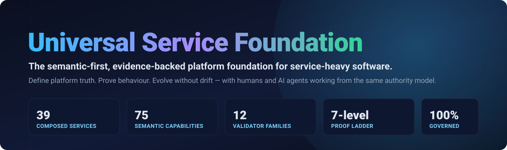
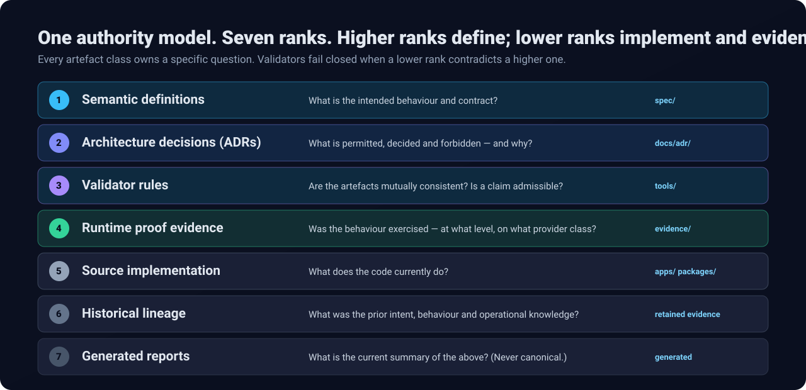
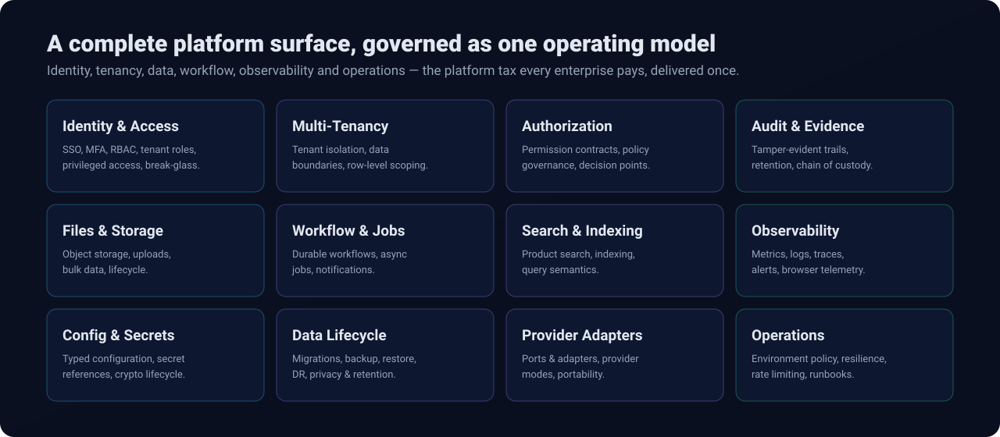
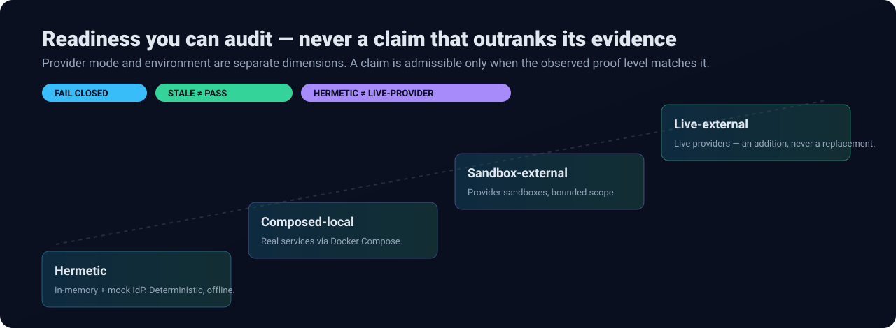
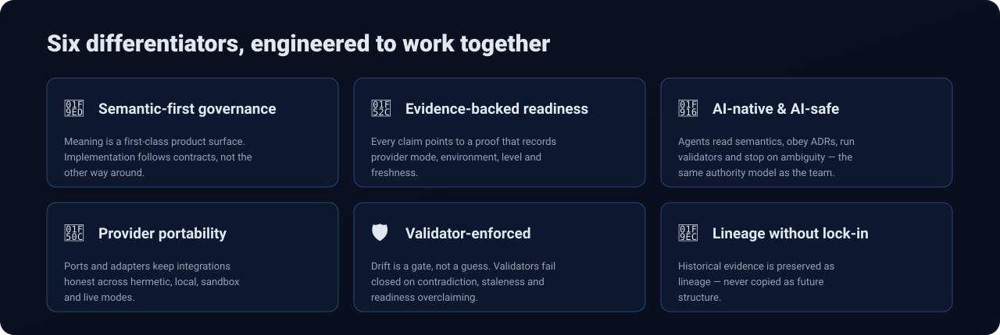

<div align="center">



**Define platform truth. Prove behaviour. Evolve without drift.**


</div>

---

## Why teams keep rebuilding the same platform — and why that ends here

Every serious product rebuilds the same foundation: identity, tenant isolation, authorization, audit, configuration, files, workflows, notifications, search, observability, provider adapters, and environment policy. Each rebuild pushes platform *truth* into scattered source files. Documentation drifts. Tests decay into partial memory. AI tools copy yesterday's patterns. "Ready" comes to mean "the checks are green" instead of "we can prove it."

**The Universal Service Foundation (USF) ends that cycle.** USF is a governed, semantic-first platform foundation that treats meaning, decisions, validation, proof, and implementation as **one operating model** — engineered from the ground up so that both humans and AI agents build from the same authority, with the same evidence, under the same guardrails.

It is not a scaffold, a template, or a framework wrapper. It is a **foundation with memory, enforcement, and proof.**

---

## What USF delivers

USF turns architecture from tribal knowledge into a governed, machine-checkable corpus — and ships it as a complete, working foundation:

- **A full enterprise platform surface** — 39 composed services and 75 semantic capabilities spanning identity, tenancy, authorization, audit, storage, workflow, search, observability, and operations.
- **A living semantic corpus** — capabilities, interfaces, events, workflows, provider modes, environments, commands, configuration, audit, and observability are all first-class governed assets under `spec/`.
- **An enforced authority model** — a strict, seven-rank hierarchy where semantics define intent, ADRs constrain change, validators enforce consistency, and evidence records what actually ran.
- **A validator suite that fails closed** — 12 validator families with hundreds of rules and planted-defect regression coverage, so drift is a gate, not a surprise.
- **An evidence-backed proof system** — a seven-level proof ladder that separates *claims* from *proof* and keeps provider modes honest.
- **A staging proof cockpit** — a browser-based review surface that turns machine QA, screenshots, and chain-of-custody evidence into an auditable review experience.
- **An ISO 27001-aligned evidence framework** — ISMS scope, risk register, Statement-of-Applicability-style control mapping, access review, secrets and crypto lifecycle, backup/DR, supplier and privacy posture.
- **AI-native delivery rules** — an explicit operating model that lets AI agents read, reason, implement, prove, and stop safely.

---

## The authority model — truth with a hierarchy



Most codebases resolve conflicts by "whoever edited last wins." USF resolves them by **authority and evidence.** Each artefact class owns a specific question, and a lower-ranked artefact can never silently override a higher-ranked one. When they disagree, that contradiction is a finding the validators surface — not a decision the freshest file gets to make.

This is what makes USF safe to evolve at speed: intent is debated in the right place, decisions are recorded, consistency is enforced, and proof records reality.

---

## A complete platform surface, governed as one model



USF delivers the capabilities every enterprise platform needs — not as isolated services, but as a coherent, semantically-mapped whole. Identity and access, multi-tenancy, authorization, audit, storage, workflow, search, observability, configuration, data lifecycle, provider adapters, and operations are all visible as platform concerns and governed together.

The payoff: you reason about the platform *before* reading code, you check readiness *instead of* trusting claims, and you evolve systems *without* losing behavioural intent.

---

## Readiness you can audit



USF's proof system is its trust engine. A proof records **provider mode, environment, observed level, emitted evidence, collected evidence, and freshness** — and the claim never outranks the artefacts behind it. Provider mode and environment are kept as independent dimensions, so a hermetic proof is never mistaken for live-provider evidence, and a production-shaped environment is never mistaken for production-live operation.

- **Fail closed** on missing evidence, contradiction, or ambiguity.
- **Stale is not pass.** Evidence that outlived its inputs is flagged, not trusted.
- **Hermetic proof is complete and offline** — the foundation proves itself with no live external dependencies, then *adds* live readiness when evidence supports it.

This is readiness a reviewer can defend line by line.

---

## Six differentiators, engineered to work together



These traits are not features bolted on — they reinforce each other. A provider-adapter change still respects contracts. A readiness statement still points to proof. An AI-assisted change still follows semantics, ADRs, validators, and stop rules. The value is difficult to copy because it lives in the semantic corpus, the authority model, the validators, the evidence posture, and the operating rules — not in any single file.

---

## AI-native and AI-safe by design

USF was built for the era of AI-assisted engineering. Agents receive **explicit inputs** — semantic definitions, decision records, and validator expectations — instead of guessing from file shape. And they operate inside hard guardrails:

1. Read the relevant **semantic definitions** first.
2. Check the **ADR canon** for what is permitted and forbidden.
3. Apply **source-lineage rules** — history is evidence, never a copy target.
4. Implement **behind contracts**, never inventing new semantics.
5. Run **validators** and **collect proof** before claiming progress.
6. **Stop** on missing semantics, forbidden decisions, failing validators, stale proof, or any attempt to overclaim.

The result is AI assistance that produces reviewable change with an evidence trail explaining *what* changed and *why it was allowed.*

---

## Developer Quickstart

The supported local handover path is documented in [Dev Readiness Validation and Handover](docs/architecture/dev-readiness-validation-and-handover.md). It is designed for a developer — or an AI agent — starting from a fresh clone with no private local state.

**Prerequisites**

- Node.js 24.16.0 or newer
- Corepack with pnpm 11.9.0
- Python 3
- Docker with the Compose plugin (for composed-provider proofs)

**One-command local validation**

```bash
make foundation
```

`make foundation` is the current-state alias for the compatibility-stable `make verify` gate.

**Useful shorter commands**

```bash
make setup                 # frozen dependency install
make validate-coverage     # foundation coverage validators
make validate-assurance    # enterprise assurance evidence
make validate-evidence     # repository evidence validators
corepack pnpm dev:smoke    # developer smoke proof
corepack pnpm runtime:proof
```

Local proofs use synthetic tenants, actors, jobs, and browser telemetry against local composed services only. They require no real tenant data, no real secrets, and no live-provider, staging, or production access.

---

## Repository orientation

USF organizes everything around governed artefact homes, each with a clear authority role and lifecycle:

| Home | Holds | Authority role |
|---|---|---|
| `docs/architecture/` | Charter, Authority Model, standards, governance | Constitutional & architectural |
| `docs/adr/` | Normative architecture decisions | What is permitted and why |
| `spec/` | Schemas, registries, taxonomies, vocabularies, semantic instances | The canonical definition of behaviour |
| `tools/` | Validators, generators, enforcement utilities | Consistency enforcement |
| `evidence/` | Proof, runtime, validation, import, and generated evidence | What actually ran |
| `apps/`, `packages/` | Implementation behind contracts | Current implementation state |

Humans and agents both know where to look, what to trust, and which checks apply.

---

## Where USF fits

USF sits at the intersection of enterprise platform engineering, internal developer platforms, regulated software delivery, reusable service foundations, provider-portable architecture, and AI-assisted engineering governance. It is the **trust layer between code generation and enterprise delivery** — defining truth, proving behaviour, and constraining change so organizations ship foundation work with clearer risk, evidence, and ownership.

If your team needs identity, tenancy, authorization, audit, configuration, workflow, observability, provider adapters, environment policy, and operational proof to behave as **shared, provable platform capabilities** — USF is built for you.

---

## Operating principle

> Serious software needs governed generation. Faster output has limited value unless the foundation also defines truth, records decisions, validates consistency, and proves behaviour.

Define semantic truth → authorize change through decisions and policy → implement within contracts → validate continuously → record evidence → evolve with proof and lineage intact.

USF tells people and machines what is true, why it is true, what proves it, what is allowed to change, and what must stop when the evidence is not enough.

<div align="center">

**Universal Service Foundation** — reason before code, evidence before trust, proof before "done."

</div>
