# Universal Service Foundation

Universal Service Foundation (USF) is a governed enterprise platform foundation for service-heavy software. It helps your team define platform truth, prove behaviour, and evolve systems without letting architecture drift into source-level guesswork.

USF treats semantics, decisions, validation, proof, and implementation as one operating model. Semantics define intent. ADRs constrain change. Validators enforce consistency. Evidence records what ran. Source code implements contracts instead of becoming the product authority.

You get a foundation built for human review and AI-assisted delivery. It gives your team clear authority, traceable proof, provider honesty, and clean implementation boundaries.

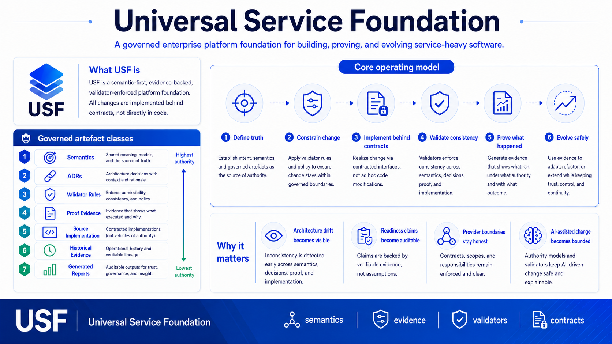

## Developer Quickstart

The supported local handover path is documented in [Dev Readiness Validation and Handover](docs/architecture/dev-readiness-validation-and-handover.md). It is intended for a developer or AI agent starting from a fresh clone with no private local state.

Prerequisites:

- Node.js 24.16.0 or newer.
- Corepack with pnpm 11.9.0.
- Python 3.
- Docker with the Compose plugin for composed-provider proof commands.

One-command local validation:

```bash
make verify
```

Useful shorter commands:

```bash
make install
corepack pnpm dev:smoke
corepack pnpm runtime:proof
corepack pnpm proof:observability:browser-telemetry
corepack pnpm parity
python3 tools/validate-spec/validate-spec.py all --json
```

Local proofs use synthetic tenants, actors, jobs, browser telemetry, and local composed services only. They do not require real tenant data, real secrets, live providers, staging, or production access.

## Why USF Exists

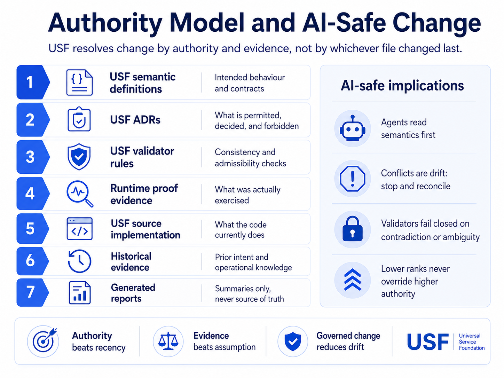

Enterprise teams keep paying the same platform tax. Identity, tenant isolation, authorization, audit, configuration, files, workflows, notifications, search, observability, operational proof, provider adapters, and environment policy appear in project after project.

A code-first foundation pushes truth into scattered files. Documentation drifts. Tests become partial memory. AI tools copy old patterns. Readiness claims rely on green checks instead of proof. Provider modes blur across mock, local, sandbox, and live operation.

USF replaces this pattern with governed foundation work. Your team defines meaning first, records decisions, validates consistency, and collects evidence. Delivery moves faster because authority is visible and review has better inputs.

## Product Differentiators

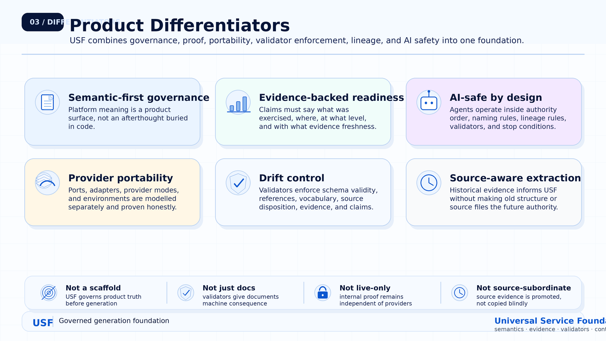

USF combines six differentiators in one foundation. Semantic governance defines meaning before reliance. Evidence-backed readiness separates claims from proof. AI-safe rules bound agent behaviour. Provider portability keeps integrations honest. Validators expose drift. Source lineage preserves historical evidence without copying old structure.

These traits work together. A provider adapter change still respects contracts. A readiness statement still points to proof. An AI-assisted change still follows semantics, ADRs, validators, and stop rules.

The result is a technical foundation with market value. Your team gets reason before code, evidence before trust, provider choice without confusion, and architecture with visible constraints.

### Semantic-First Platform Governance

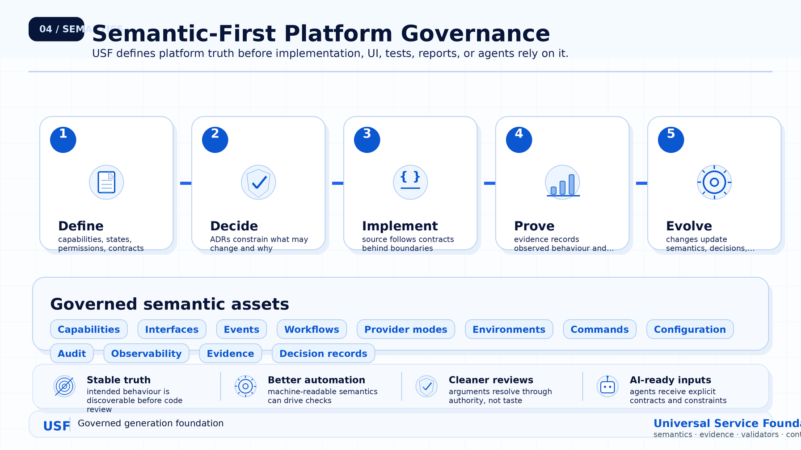

USF treats platform meaning as a first-class product surface. Capabilities, interfaces, events, workflows, provider modes, environments, commands, configuration, audit, observability, evidence, and decision records are governed assets.

This changes how teams build. Implementation follows semantic contracts. UI and reports reflect defined behaviour. Validators check alignment across semantics, decisions, proof, and source. AI agents receive explicit inputs instead of copying file shape.

You get stable truth before code review starts. The team debates intent in the right place, then implements against a shared model. This reduces ambiguity, rework, and hidden behaviour.

### Evidence-Backed Readiness

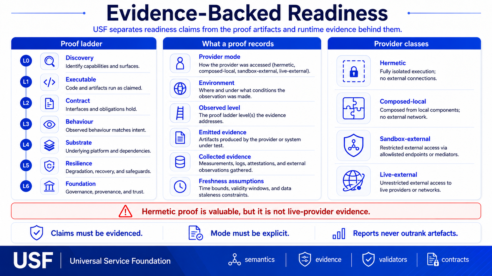

USF separates readiness claims from proof. A proof records provider mode, environment, observed level, emitted evidence, collected evidence, and freshness assumptions. The claim never outranks the artefacts behind it.

This matters for enterprise trust. Hermetic proof is useful for internal correctness. It is not live-provider evidence. A generated report helps explain a state. It is not the source of truth. Production-shaped environments also differ from production-live operation.

Your team gets measurable readiness. Reviewers see what ran, where it ran, which proof level was reached, and which assumptions still apply. This makes go-live claims easier to audit.

### AI-Safe by Design


USF gives AI agents a bounded operating model. Agents read semantic definitions first, check ADRs, apply source-lineage rules, implement behind contracts, run validators, and collect proof before claiming progress.

The repository also gives clear stop conditions. Missing semantics, forbidden decisions, failing validators, stale proof, source-only behaviour, and provider overclaiming block progress. The right response is reconciliation, not pattern imitation.

You get AI assistance with guardrails. Changes become easier to review because the agent follows the same authority model as the team. The evidence trail explains what changed and why it was allowed.

### Provider-Portable Architecture

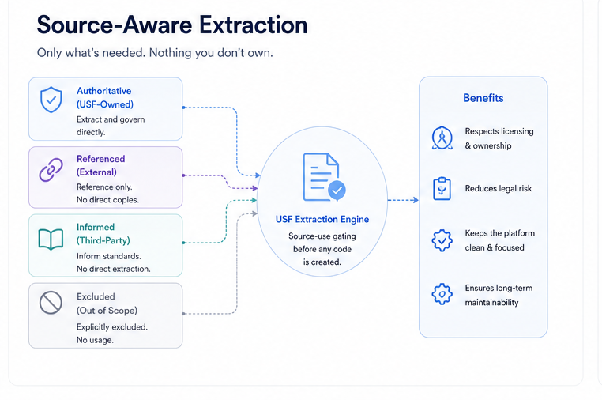

USF separates provider contracts from provider implementations. Ports define the boundary. Adapters implement the boundary. Provider modes describe how the implementation runs. Environments define context and constraints.

This separation keeps portability honest. Hermetic, composed-local, sandbox-external, and live-external modes each support different claims. A proof has value only when the provider mode and observed level match the claim.

Your team gets provider choice without weakening internal proof. You swap adapters behind stable contracts, add live readiness when evidence supports it, and keep mock, local, sandbox, and live claims distinct.

### Validator-Enforced Drift Control

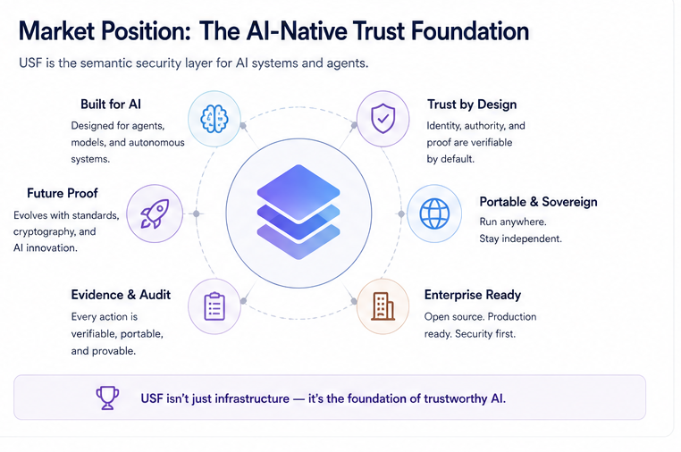

USF uses validators as enforcement. Validators check schema validity, reference resolution, vocabulary usage, source disposition, provider-mode honesty, environment honesty, evidence completeness, and readiness overclaiming.

The validator layer turns architecture rules into gates. It fails closed on contradiction or ambiguity. A stale report does not pass because it sounds convincing. A source change does not pass because it compiles. A readiness claim does not pass without proof.

Your team gets drift control before drift compounds. Findings point to the artefact class with authority over the problem. Remediation updates the right source, then validation proves consistency.

### Source-Aware Without Being Source-Subordinate

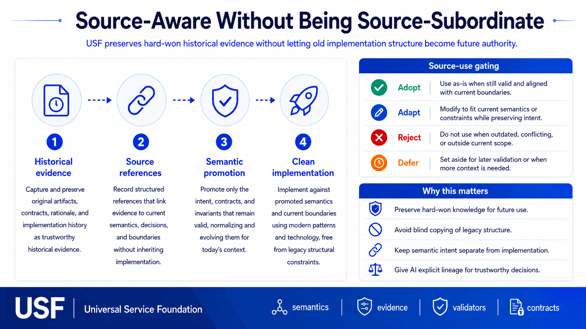

USF preserves historical evidence without making old implementation structure the future authority. Historical evidence captures intent, contracts, rationale, proof signals, operational history, and lessons from prior work.

Source-use gating decides how evidence enters USF. Some evidence is adopted. Some is adapted. Some is rejected. Some is deferred. Every path preserves intent through semantics, decisions, validators, and proof expectations.

Your team keeps knowledge without inheriting old constraints. The new implementation follows promoted semantics and clean boundaries. AI agents also see lineage, so they use history as evidence instead of copying it blindly.

## Strengths

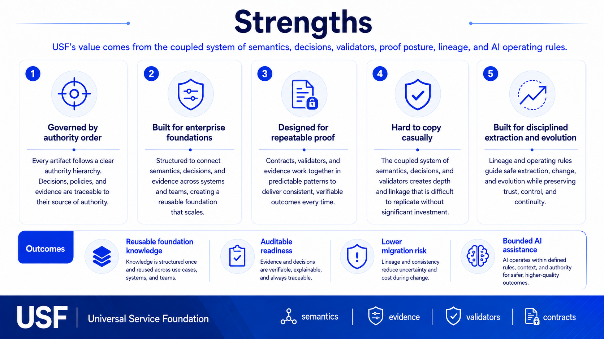

USF draws strength from a coupled system. Authority order gives each artefact class a role. Semantic definitions own intended behaviour. ADRs own decisions. Validators own consistency. Proof owns what ran. Source owns current implementation state.

The foundation also fits enterprise work. Tenant isolation, authorization, audit, configuration, workflows, provider adapters, observability, evidence, and operational commands stay visible as platform concerns. They are not hidden inside one service.

You get repeatable proof, lower migration risk, and bounded AI assistance. The value is difficult to copy because it lives in the semantic corpus, authority model, validators, evidence posture, lineage, and operating rules.

## What Makes USF Unique

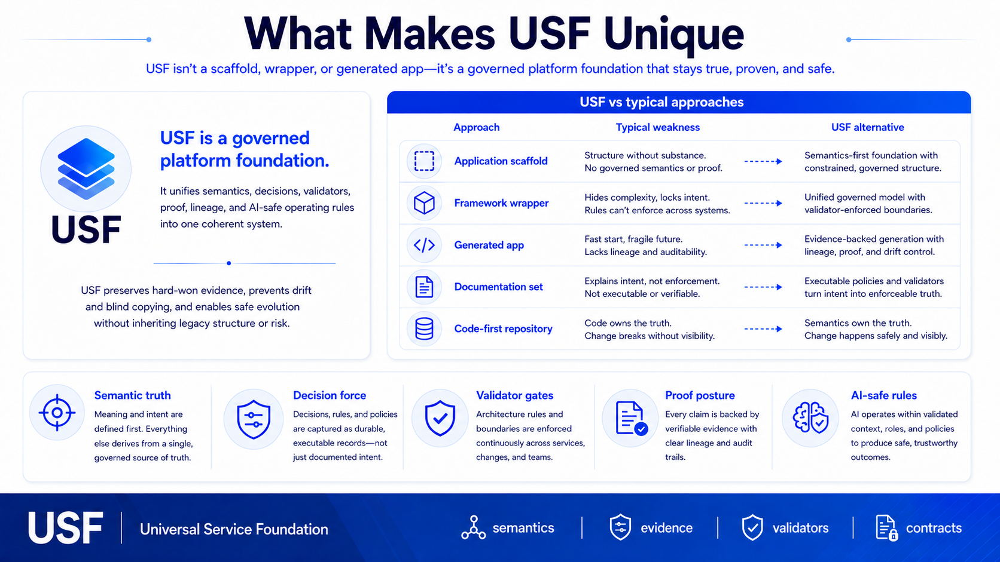

USF is different from an application scaffold, service template, framework wrapper, generated app, or documentation set. Those approaches often start with structure or output. USF starts with governed product truth.

The difference is practical. Semantics define behaviour. ADRs decide constraints. Validators enforce the rules. Proof records what ran. Source lineage preserves historical evidence. Implementation follows contracts. AI agents operate inside the same model.

Your team gets a foundation with memory, enforcement, and proof. You reason about the platform before reading code. You check readiness instead of trusting claims. You evolve systems without losing behavioural intent.

## Market Position

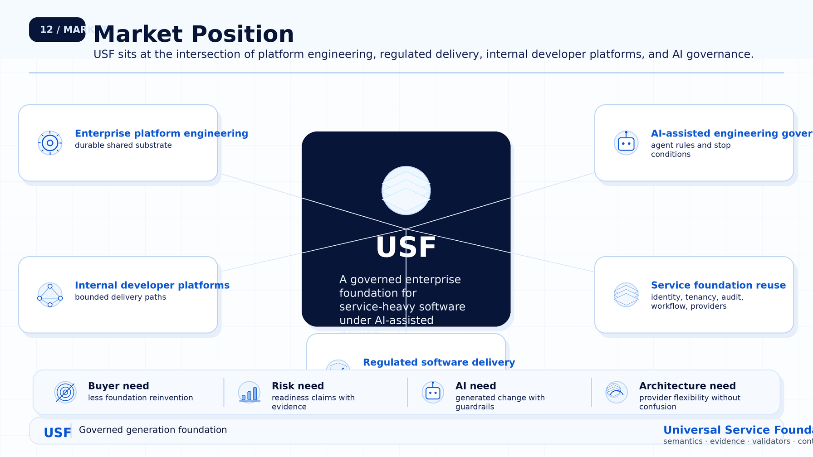

USF fits the intersection of enterprise platform engineering, internal developer platforms, regulated software delivery, reusable service foundations, provider-portable architecture, and AI-assisted engineering governance.

It serves teams with durable foundation needs. Those teams need identity, tenancy, authorization, audit, configuration, workflow, observability, provider adapters, environment policy, and operational proof to work as shared platform capabilities.

You get a trust layer between code generation and enterprise delivery. USF defines truth, proves behaviour, and constrains change. It helps your organization ship foundation work with clearer risk, evidence, and ownership.

## Repository Orientation

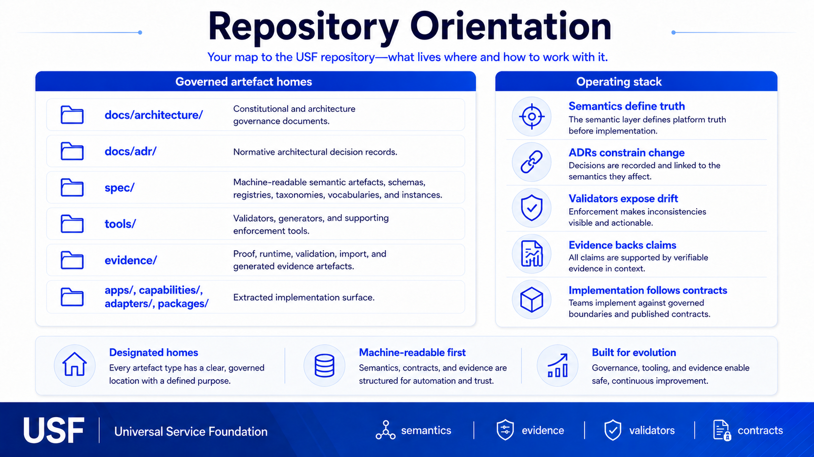

USF organizes the repository around governed artefact homes. `docs/architecture/` holds constitutional and architecture governance. `docs/adr/` holds normative decisions. `spec/` holds schemas, registries, taxonomies, vocabularies, and semantic instances.

`tools/` holds validators, generators, and enforcement utilities. `evidence/` holds proof, runtime, validation, import, and generated evidence. `apps/`, `capabilities/`, `adapters/`, and `packages/` hold implementation behind contracts.

You get a repository map with purpose. Each artefact class has a home, authority role, and lifecycle. Humans and agents both know where to look, what to trust, and which checks apply.

## Operating Principle

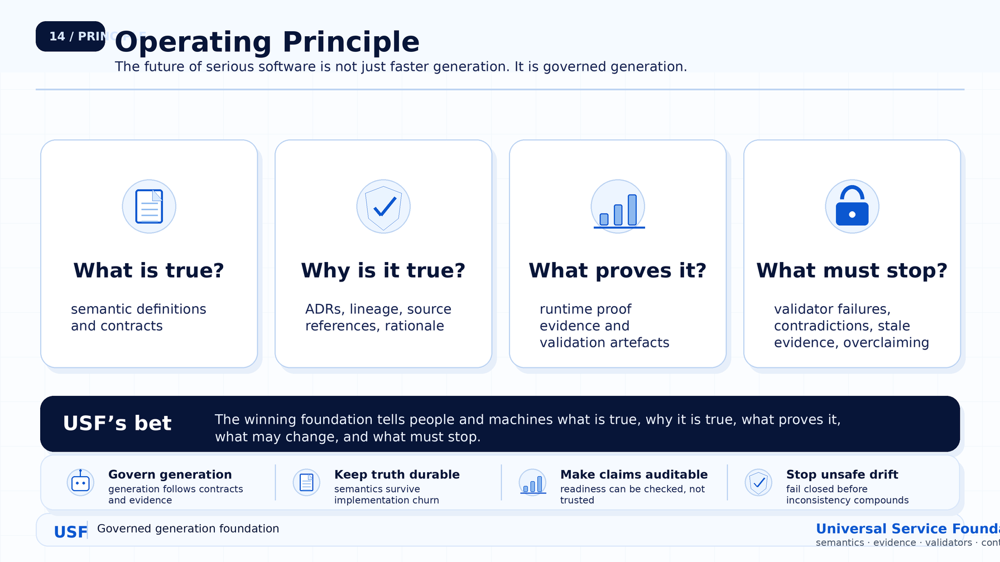

USF makes one practical claim. Serious software needs governed generation. Faster output has limited value unless the foundation also defines truth, records decisions, validates consistency, and proves behaviour.

The operating loop is simple. Define semantic truth. Authorize change through decisions and policy. Implement within contracts. Validate continuously. Record evidence. Evolve with proof and lineage intact.

Your team gets a foundation built for safe change. It tells people and machines what is true, why it is true, what proves it, what is allowed to change, and what must stop when evidence is not enough.
